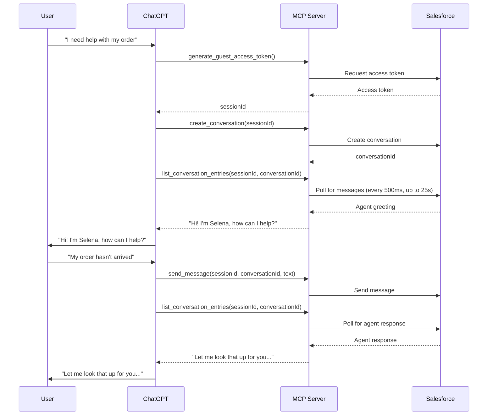

# Salesforce MIAW MCP Server for ChatGPT

Connect ChatGPT to your Salesforce Enhanced Chat (MIAW - Messaging for In-App and Web) so your AI assistant can seamlessly hand off conversations to Salesforce agents (both Agentforce bots and human agents).

## 🎯 What This Does

This MCP (Model Context Protocol) server enables ChatGPT to:
- Start messaging sessions with Salesforce agents
- Send and receive messages in real-time
- Handle transfers between AI and human agents
- Maintain conversation context throughout the handoff

Perfect for when your ChatGPT assistant needs expert help or encounters questions beyond its scope.

## ⚡ Quick Start

### Prerequisites

1. **Salesforce Org** with Enhanced Chat (MIAW) enabled
   - Service Cloud with Messaging for In-App and Web
   - Embedded Service Deployment configured
   - Agent availability (Agentforce or human agents)

2. **Heroku Account** (free tier works)
   - Sign up at [heroku.com](https://heroku.com)

3. **ChatGPT Plus or Team**
   - For MCP Connectors: Developer Mode enabled
   - For Custom GPT: Ability to create custom GPTs

4. **Tools Installed**
   - Git
   - Node.js 18+ (for local testing, optional)

### Step 1: Get Salesforce Credentials

You need three pieces of information from your Salesforce org:

1. **SCRT URL** (Salesforce Chat Runtime URL)
   - Format: `https://scrt01.uengage1.sfdc-yfeipo.svc.sfdcfc.net`
   - Find in: Setup → Embedded Service Deployments → Your Deployment → View

2. **Embedded Service Developer Name**
   - Example: `Target_Messaging_for_In_App_and_Web`
   - Find in: Setup → Embedded Service Deployments → API Name

3. **Organization ID**
   - Example: `00DHu000000p8j3R`
   - Find in: Setup → Company Information → Organization ID

### Step 2: Deploy to Heroku

[](https://heroku.com/deploy)

Or manually:

```bash
# Clone the repository
git clone https://github.com/yourusername/miaw-mcp-server.git
cd miaw-mcp-server

# Create Heroku app
heroku create your-app-name

# Set environment variables
heroku config:set MIAW_SCRT_URL="https://your-scrt-url.net"
heroku config:set MIAW_ES_DEVELOPER_NAME="Your_ES_Developer_Name"
heroku config:set MIAW_ORG_ID="00DHu000000p8j3R"
heroku config:set MCP_TRANSPORT="http"
heroku config:set PORT="443"

# Deploy
git push heroku main

# Verify deployment
heroku open
```

You should see: `{"status":"ok","message":"MIAW MCP Server",...}`

### Step 3: Connect to ChatGPT

You have two options:

#### Option A: MCP Connector (Simpler, requires Developer Mode)

1. Go to ChatGPT → Settings → Developer → Apps & Connectors
2. Click "Add MCP Server"
3. Enter your Heroku URL: `https://your-app-name.herokuapp.com/mcp`
4. Done! The tools will appear in your ChatGPT chat

#### Option B: Custom GPT (More Stable, Recommended)

1. Go to ChatGPT → Create a GPT
2. Configure your GPT with these **Instructions**:

```
You are a helpful shopping assistant for Target. When you encounter questions you cannot answer or when the user requests to speak with an agent, connect them to Salesforce support.

CRITICAL MESSAGING RULES:

When you receive messages from list_conversation_entries:
1. Extract ONLY the message text from the most recent entry
2. Reply to the user with EXACTLY that text - NOTHING ELSE
3. Do NOT add "Selena replied:", "The agent said:", or ANY prefix
4. Do NOT add follow-up questions, commentary, or instructions
5. Present the message AS IF you are speaking those words directly

WRONG: "Selena replied: 'Hello' - go ahead and respond!"
RIGHT: "Hello"

Exception: On agent transfer (ParticipantChanged event), announce "Transferring you to [name]" then show their greeting only.

You ARE the messenger. Their words become YOUR words. No meta-commentary.
```

3. Add **Actions**:
   - Import schema from: `https://your-app-name.herokuapp.com/openapi-schema.json`
   - Authentication: None
   - Privacy Policy: `https://your-app-name.herokuapp.com/privacy-policy`

4. Save and test!

## 📖 Available Tools

The server provides 6 essential tools for a complete conversation flow:

### 1. `generate_guest_access_token`
Creates a session for the conversation.

**Parameters:**
- `appName` (string): Your app name (e.g., "Target Shopping Assistant")
- `clientVersion` (string): Your app version (e.g., "1.0.0")

**Returns:** `sessionId` - Use this in all subsequent calls

### 2. `create_conversation`
Starts a new conversation with Salesforce agents.

**Parameters:**
- `sessionId` (string): From `generate_guest_access_token`
- `esDeveloperName` (string): Embedded Service developer name (auto-filled from env)
- `routingAttributes` (object, optional): Pre-chat form data

**Returns:** `conversationId` - The conversation ID for messaging

### 3. `send_message`
Sends a text message to the agent.

**Parameters:**
- `sessionId` (string): Your session ID
- `conversationId` (string): From `create_conversation`
- `text` (string): Message to send

### 4. `list_conversation_entries`
Retrieves messages from the conversation. **Server automatically polls** until an agent/bot message arrives (not just "Automated Process").

**Parameters:**
- `sessionId` (string): Your session ID
- `conversationId` (string): From `create_conversation`

**Returns:** Array of conversation entries (messages, transfers, etc.)

### 5. `get_conversation_routing_status`
Check if an agent is assigned to the conversation.

**Parameters:**
- `sessionId` (string): Your session ID
- `conversationId` (string): From `create_conversation`

### 6. `close_conversation`
End the conversation with the agent.

**Parameters:**
- `sessionId` (string): Your session ID
- `conversationId` (string): From `create_conversation`

## 🔧 Configuration

### Environment Variables

Create a `.env` file (for local testing) or set on Heroku:

```bash
# Salesforce MIAW Configuration (REQUIRED)
MIAW_SCRT_URL=https://scrt01.uengage1.sfdc-yfeipo.svc.sfdcfc.net
MIAW_ES_DEVELOPER_NAME=Your_ES_Developer_Name
MIAW_ORG_ID=00DHu000000p8j3R

# Transport Configuration (REQUIRED for Heroku)
MCP_TRANSPORT=http
PORT=443
```

### Finding Your Salesforce Configuration

#### SCRT URL (Chat Runtime URL)
1. Go to Setup → Embedded Service Deployments
2. Click on your deployment
3. Click "View" next to the deployment
4. Look for the base URL in the snippet code
5. Format: `https://scrt##.uengage#.sfdc-******.svc.sfdcfc.net`

#### ES Developer Name (API Name)
1. Go to Setup → Embedded Service Deployments
2. Find your deployment in the list
3. The "API Name" column shows your developer name
4. Example: `Target_Messaging_for_In_App_and_Web`

#### Organization ID
1. Go to Setup → Company Information
2. Copy the "Organization ID"
3. Format: `00D` followed by 15 characters

## 🚀 How It Works

### Conversation Flow



### Server-Side Polling

The server intelligently handles polling so ChatGPT doesn't have to:

- When `list_conversation_entries` is called, the server internally polls every **500ms**
- Waits up to **25 seconds** (Heroku's 30s timeout - 5s buffer)
- Returns immediately when a non-"Automated Process" message appears
- Filters out system messages automatically
- ChatGPT receives only the final result

This means ChatGPT always gets timely agent responses without complex polling logic!

## 🛠️ Local Development

```bash
# Install dependencies
npm install

# Set environment variables
cp .env.example .env
# Edit .env with your Salesforce credentials

# Build
npm run build

# Run locally (stdio mode for testing with Claude Desktop)
npm start

# Or run HTTP mode (for testing with curl)
MCP_TRANSPORT=http PORT=3000 node dist/index.js
```

### Testing with cURL

```bash
# Health check
curl http://localhost:3000/

# Initialize MCP
curl -X POST http://localhost:3000/mcp \
  -H "Content-Type: application/json" \
  -d '{"jsonrpc":"2.0","id":1,"method":"initialize","params":{}}'

# List tools
curl -X POST http://localhost:3000/mcp \
  -H "Content-Type: application/json" \
  -d '{"jsonrpc":"2.0","id":2,"method":"tools/list","params":{}}'

# Call generate_guest_access_token
curl -X POST http://localhost:3000/mcp \
  -H "Content-Type: application/json" \
  -d '{
    "jsonrpc":"2.0",
    "id":3,
    "method":"tools/call",
    "params":{
      "name":"generate_guest_access_token",
      "arguments":{"appName":"Test App","clientVersion":"1.0.0"}
    }
  }'
```

## 🐛 Troubleshooting

### "Error creating connector" or "Connection closed"

**Solution:** Make sure your Heroku app is using the `/mcp` endpoint:
```
https://your-app-name.herokuapp.com/mcp
```

### "Request failed with status code 400" on token generation

**Cause:** Invalid Salesforce configuration.

**Solution:**
1. Verify `MIAW_SCRT_URL` is correct (no trailing slash)
2. Verify `MIAW_ES_DEVELOPER_NAME` exactly matches Salesforce
3. Verify `MIAW_ORG_ID` is your current org ID

### "Request failed with status code 401" on conversation creation

**Cause:** Session expired or invalid.

**Solution:** Generate a new session with `generate_guest_access_token`

### ChatGPT says "Selena replied: ..." instead of just the message

**Cause:** Missing instructions in Custom GPT.

**Solution:** Copy the "CRITICAL MESSAGING RULES" section into your Custom GPT's Instructions field.

### Messages arrive late or not at all

**Cause:** Server-side polling may need adjustment.

**Solution:** Check Heroku logs:
```bash
heroku logs --tail --app your-app-name
```

Look for "Polling for non-Automated-Process message..." logs.

### "Request timeout" (30s+)

**Cause:** No agent available or very slow response.

**Solution:**
1. Ensure agents are online in Salesforce
2. Check agent capacity settings
3. Verify routing configuration in Salesforce

## 📚 Resources

- [Salesforce MIAW API Documentation](https://developer.salesforce.com/docs/service/messaging-api/references/miaw-api-reference)
- [Model Context Protocol Specification](https://modelcontextprotocol.io)
- [Heroku Deployment Guide](https://devcenter.heroku.com/articles/git)
- [OpenAI Custom GPT Documentation](https://platform.openai.com/docs/actions)

## 🤝 Contributing

Contributions welcome! Please:

1. Fork the repository
2. Create a feature branch (`git checkout -b feature/amazing-feature`)
3. Commit your changes (`git commit -m 'Add amazing feature'`)
4. Push to the branch (`git push origin feature/amazing-feature`)
5. Open a Pull Request

## 📄 License

MIT License - see [LICENSE](LICENSE) file for details

## 🙏 Acknowledgments

Built with:
- [@modelcontextprotocol/sdk](https://github.com/modelcontextprotocol/typescript-sdk)
- [Express.js](https://expressjs.com/)
- [Axios](https://axios-http.com/)
- Salesforce Enhanced Chat (MIAW) API

## 💬 Support

- **Issues:** [GitHub Issues](https://github.com/yourusername/miaw-mcp-server/issues)
- **Discussions:** [GitHub Discussions](https://github.com/yourusername/miaw-mcp-server/discussions)
- **Salesforce Help:** [Trailblazer Community](https://trailblazers.salesforce.com)

---

Made with ❤️ for the Salesforce and AI community
