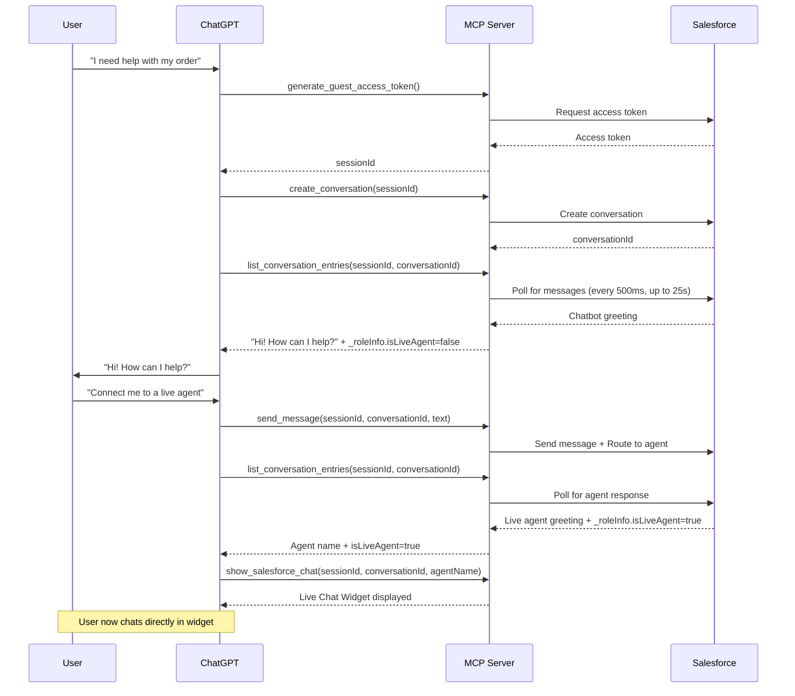

# Salesforce MIAW MCP Server

Connect ChatGPT to your Salesforce Enhanced Chat (MIAW - Messaging for In-App and Web) so your AI assistant can seamlessly hand off conversations to Salesforce agents (both Agentforce bots and human agents).

## 🎯 What This Does

This MCP (Model Context Protocol) server enables ChatGPT to:
- Start messaging sessions with Salesforce agents
- Send and receive messages in real-time
- Handle transfers between AI chatbots and human agents
- **Display a live chat widget** when transferred to a human agent
- **End chat sessions** properly on both sides
- **Detect when agents end the chat** and notify users
- Maintain conversation context throughout the handoff

Perfect for when your ChatGPT assistant needs expert help or encounters questions beyond its scope.

## ⚡ Quick Start

### Prerequisites

1. **Salesforce Org** with Enhanced Chat (MIAW) enabled
   - Messaging for In-App and Web Channel configured and deployed in Messaging Settings
   - Embedded Service Deployment configured and published **Make sure it's configured as "Custom Client"**
   - Omni-channel Routing & Flows configured (Agent - human escalation)
   - Agentforce Activated with Outbound Omni-channel Connection configured
   - Live Agent Messaging Channel configured

2. **Heroku Account**
   - Sign up or sign in at [heroku.com](https://heroku.com)
   - Create an app to host the MCP Server, name it: "miaw-mcp-server"

3. **ChatGPT Plus or Team**
   - For MCP Connectors: Developer Mode enabled in Settings
   - For Custom GPT: Create your own custom GPT

4. **Tools Installed**
   - Git
   - Node.js 18+ (for local testing, optional)

### Step 1: Get Salesforce Credentials

You need three pieces of information from your Salesforce org (easiest to find all of this information is at Setup → Embedded Service Deployments → Your Deployment → Install Code Snippet → Chat Code Snippet):

1. **SCRT URL** (Salesforce Chat Runtime URL)
   - Format: `https://your-org-url.my.salesforce-scrt.com`

2. **Embedded Service Developer Name**
   - Example: `Target_Messaging_for_In_App_and_Web`

3. **Organization ID**
   - Example: `00DHu000000p8j3R`

### Step 2: Deploy to Heroku & Clone from Github

1. Go to the Heroku App you made → "Deploy" tab → Scroll down to "Deploy using Heroku Git" for all commands
2. In your favorite IDE, Open a New Terminal
3. Clone the Git repository by typing in: "git clone https://github.com/skyrmionz/miaw-mcp-server.git" and hit Enter
4. Type in: "heroku login" and hit Enter → Follow the prompts to authenticate
6. Make sure you're in the correct directory by checking if you're in "miaw-mcp-server", if not type in: "cd miaw-mcp-server" and hit Enter

```
cd miaw-mcp-server
git init
heroku git:remote -a chatgpt-components
git add .
git commit -am "(enter your comment here)"
git push heroku main
```
Afterwards, you'll still need to set the Environment Variables in your Heroku App, which you got from earlier:

1. Go to the Heroku App again → "Settings" tab → Scroll down to "Config Vars" → "Reveal Config Vars" or start adding Environment Variables.
2. Add these Environment Variables:

```
Key: MCP_TRANSPORT | Value: http
Key: MIAW_ES_DEVELOPER_NAME | Value: (Your Embedded Service Deployment API Name)
Key: MIAW_ORG_ID | Value: (Your Org ID)
Key: MIAW_SCRT_URL | Value: (Your Org's SCRT URL)
```

### Step 3: Connect to ChatGPT

You have two options to deploy to ChatGPT:

#### Option A: Deploy it as a Connector (Simpler, requires Developer Mode, needs approval for tool calls)

1. Go to ChatGPT → Profile → Settings → Apps & Connectors → Advanced Settings → Developer Mode "On" → Back
2. Click "Create" in the top right corner
3. Add an image for the Icon (Optional)
4. Name your Connector
5. Add a Description (how/when should ChatGPT use the Connector?)
6. Enter your Heroku URL to the "MCP Server URL": `https://your-app-name.herokuapp.com/mcp`
7. Set Authentication as "No authentication"
8. Check the "I understand and want to continue..." box
9. Click the "Create" button
10. Done! The Connector will be connected to your ChatGPT
11. Test out the connection!

#### Option B: Custom GPT (Customize a GPT you can share, executes tool calls without MCP and without approval)

1. Go to ChatGPT → GPTs → Explore → Create
2. When editing your GPT, go to the "Configure" tab. Add these **Instructions**:

```
You are a helpful shopping assistant for Target. When you encounter questions you cannot answer or when the user requests to speak with an agent, connect them to Salesforce support.

CRITICAL MESSAGING RULES:

When you receive messages from list_conversation_entries:
1. Extract ONLY the message text from the most recent entry
2. Reply to the user with EXACTLY that text - NOTHING ELSE
3. Do NOT add "Selena replied:", "The agent said:", or ANY prefix
4. Do NOT add follow-up questions, commentary, or instructions
5. Present the message AS IF you are speaking those words directly

WRONG: "Selena replied: 'Hello' - go ahead and respond!"
RIGHT: "Hello"

Exception: On agent transfer (ParticipantChanged event), announce "Transferring you to [name]" then show their greeting only.

You ARE the messenger. Their words become YOUR words. No meta-commentary.
```

3. Scroll down to **Actions**:
   - Click on "Create new action"
   - Import from URL: `https://your-app-name.herokuapp.com/openapi-schema.json`
   - Authentication: None
   - Scroll down to Privacy Policy and put in: `https://your-app-name.herokuapp.com/privacy-policy`

4. Click "Update" or "Create" in the upper right hand corner and test!

## 📖 Available Tools

The server provides 7 essential tools for a complete conversation flow:

### 1. `generate_guest_access_token`
Creates a session for the conversation.

**Parameters:**
- `appName` (string): Your app name (e.g., "Target Shopping Assistant")
- `clientVersion` (string): Your app version (e.g., "1.0.0")

**Returns:** `sessionId` - Use this in all subsequent calls

### 2. `create_conversation`
Starts a new conversation with Salesforce agents.

**Parameters:**
- `sessionId` (string): From `generate_guest_access_token`
- `esDeveloperName` (string): Embedded Service developer name (auto-filled from env)
- `routingAttributes` (object, optional): Pre-chat form data

**Returns:** `conversationId` - The conversation ID for messaging

### 3. `send_message`
Sends a text message to the agent.

**Parameters:**
- `sessionId` (string): Your session ID
- `conversationId` (string): From `create_conversation`
- `text` (string): Message to send

### 4. `list_conversation_entries`
Retrieves messages from the conversation. **Server automatically polls** until an agent/bot message arrives (not just "Automated Process").

**Parameters:**
- `sessionId` (string): Your session ID
- `conversationId` (string): From `create_conversation`
- `skipPolling` (boolean, optional): Set to `true` for immediate response (used by widget)

**Returns:** 
- `entries`: Array of conversation entries (messages only - Chatbot/Agent)
- `_roleInfo`: Contains `isLiveAgent`, `conversationEnded`, `endedByAgent` flags

### 5. `get_conversation_routing_status`
Check if an agent is assigned to the conversation.

**Parameters:**
- `sessionId` (string): Your session ID
- `conversationId` (string): From `create_conversation`

### 6. `close_conversation`
End the conversation with the agent. Calls both `endMessagingSession` and `closeConversation` Salesforce APIs.

**Parameters:**
- `sessionId` (string): Your session ID
- `conversationId` (string): From `create_conversation`

### 7. `show_salesforce_chat` ✨ NEW
Displays an embedded live chat widget when transferred to a human agent. **Only call when `_roleInfo.isLiveAgent=true`**.

**Parameters:**
- `sessionId` (string): From `_roleInfo.sessionIdToUse`
- `conversationId` (string): From `_roleInfo.conversationIdToUse`
- `agentName` (string): From `_roleInfo.mostRecentSenderName`

**Features:**
- Real-time message polling
- Send/receive messages directly in the widget
- Agent initials displayed in avatar
- "End Chat" button to close the session
- Automatically detects when agent ends the chat

## 🚀 How It Works

### Conversation Flow



### Live Agent Widget

When a human agent joins the conversation, ChatGPT automatically displays an embedded chat widget:

- **Real-time messaging** - Messages appear instantly
- **Agent info** - Shows agent name and initials
- **End Chat button** - User can end the session
- **Auto-detection** - Knows when agent ends the chat
- **Styled interface** - Professional chat UI that matches ChatGPT

### Server-Side Polling

The server intelligently handles polling so ChatGPT doesn't have to:

- When `list_conversation_entries` is called, the server internally polls every **500ms**
- Waits up to **25 seconds** (Heroku's 30s timeout - 5s buffer)
- Returns immediately when a non-"Automated Process" message appears
- Filters out system messages automatically
- ChatGPT receives only the final result

This means ChatGPT always gets timely agent responses without complex polling logic!

## 🛠️ Local Development

```bash
# Install dependencies
npm install

# Set environment variables
cp .env.example .env
# Edit .env with your Salesforce credentials

# Build
npm run build

# Run locally (stdio mode for testing with Claude Desktop)
npm start

# Or run HTTP mode (for testing with curl)
MCP_TRANSPORT=http PORT=3000 node dist/index.js
```

### Testing with cURL

```bash
# Health check
curl http://localhost:3000/

# Initialize MCP
curl -X POST http://localhost:3000/mcp \
  -H "Content-Type: application/json" \
  -d '{"jsonrpc":"2.0","id":1,"method":"initialize","params":{}}'

# List tools
curl -X POST http://localhost:3000/mcp \
  -H "Content-Type: application/json" \
  -d '{"jsonrpc":"2.0","id":2,"method":"tools/list","params":{}}'

# Call generate_guest_access_token
curl -X POST http://localhost:3000/mcp \
  -H "Content-Type: application/json" \
  -d '{
    "jsonrpc":"2.0",
    "id":3,
    "method":"tools/call",
    "params":{
      "name":"generate_guest_access_token",
      "arguments":{"appName":"Test App","clientVersion":"1.0.0"}
    }
  }'
```

## 🐛 Troubleshooting

### "Error creating connector" or "Connection closed"

**Solution:** Make sure your Heroku app is using the `/mcp` endpoint:
```
https://your-app-name.herokuapp.com/mcp
```

### "Request failed with status code 400" on token generation

**Cause:** Invalid Salesforce configuration.

**Solution:**
1. Verify `MIAW_SCRT_URL` is correct (no trailing slash)
2. Verify `MIAW_ES_DEVELOPER_NAME` exactly matches Salesforce
3. Verify `MIAW_ORG_ID` is your current org ID

### "Request failed with status code 401" on conversation creation

**Cause:** Session expired or invalid.

**Solution:** Generate a new session with `generate_guest_access_token`

### ChatGPT says "Selena replied: ..." instead of just the message

**Cause:** Missing instructions in Custom GPT.

**Solution:** Copy the "CRITICAL MESSAGING RULES" section into your Custom GPT's Instructions field.

### Messages arrive late or not at all

**Cause:** Server-side polling may need adjustment.

**Solution:** Check Heroku logs:
```bash
heroku logs --tail --app your-app-name
```

Look for "Polling for non-Automated-Process message..." logs.

### "Request timeout" (30s+)

**Cause:** No agent available or very slow response.

**Solution:**
1. Ensure agents are online in Salesforce
2. Check agent capacity settings
3. Verify routing configuration in Salesforce

### End Chat button not working / 404 errors

**Cause:** Incorrect API endpoint paths.

**Solution:** The server now uses the correct Salesforce MIAW API endpoints:
- `DELETE /conversation/{id}/session?esDeveloperName={name}` - Ends messaging session
- `DELETE /conversation/{id}?esDeveloperName={name}` - Closes conversation

Make sure your `MIAW_ES_DEVELOPER_NAME` environment variable is set correctly.

### Agent ends chat but widget doesn't update

**Cause:** Widget not detecting the "agent has ended the chat" message.

**Solution:** The server now detects messages from "Automated Process" containing:
- "agent has ended the chat"
- "chat has ended"
- "conversation has ended"

The widget will automatically show "The agent has ended this chat session" and disable input.

### Live chat widget not appearing

**Cause:** `show_salesforce_chat` called too early or `isLiveAgent` not detected.

**Solution:** 
1. Check that `_roleInfo.isLiveAgent` is `true` before calling `show_salesforce_chat`
2. Only call when `mostRecentSenderRole` is "Agent" (not "Chatbot")

## 📚 Resources

- [Salesforce MIAW API Documentation](https://developer.salesforce.com/docs/service/messaging-api/references/miaw-api-reference)
- [Model Context Protocol Specification](https://modelcontextprotocol.io)
- [Heroku Deployment Guide](https://devcenter.heroku.com/articles/git)
- [OpenAI Custom GPT Documentation](https://platform.openai.com/docs/actions)

## 🤝 Contributing

Contributions welcome! Please:

1. Fork the repository
2. Create a feature branch (`git checkout -b feature/amazing-feature`)
3. Commit your changes (`git commit -m 'Add amazing feature'`)
4. Push to the branch (`git push origin feature/amazing-feature`)
5. Open a Pull Request

## 📄 License

MIT License - see [LICENSE](LICENSE) file for details

## 🙏 Acknowledgments

Built with:
- [@modelcontextprotocol/sdk](https://github.com/modelcontextprotocol/typescript-sdk)
- [Express.js](https://expressjs.com/)
- [Axios](https://axios-http.com/)
- Salesforce Enhanced Chat (MIAW) API

## 💬 Support

- **Issues:** [GitHub Issues](https://github.com/skyrmionz/miaw-mcp-server/issues)
- **Discussions:** [GitHub Discussions](https://github.com/skyrmionz/miaw-mcp-server/discussions)
- **Salesforce Help:** [Trailblazer Community](https://trailblazers.salesforce.com)

---

Made with ❤️ for the Salesforce and AI community
